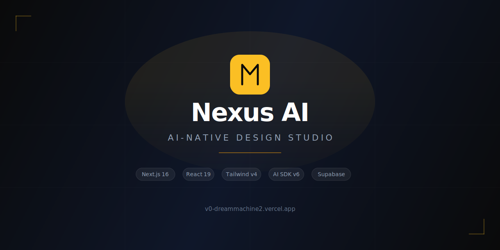
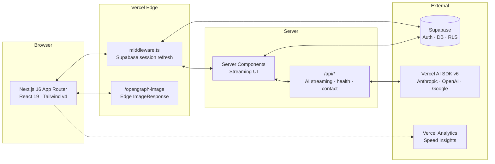

<div align="center">
  <br />
  <a href="https://v0-dreammachine2.vercel.app">
    
  </a>
  <br /><br />

  <p>
    <strong>An open-source, AI-native design studio</strong> — the marketing site, client dashboard,<br/>
    and AI workflow you'd want behind your own studio's front door.
  </p>

  <p>
    <a href="https://github.com/Alexi5000/v0-dreammachine2/actions/workflows/ci.yml"></a>
    <a href="LICENSE"></a>
    <a href="https://nextjs.org"></a>
    <a href="https://react.dev"></a>
    <a href="https://tailwindcss.com"></a>
    <a href="https://sdk.vercel.ai"></a>
    <a href="https://supabase.com"></a>
    <a href="CONTRIBUTING.md"></a>
  </p>

  <p>
    <a href="https://v0-dreammachine2.vercel.app"><strong>Live&nbsp;demo</strong></a>&nbsp;&nbsp;&middot;&nbsp;&nbsp;
    <a href="#getting-started"><strong>Getting&nbsp;started</strong></a>&nbsp;&nbsp;&middot;&nbsp;&nbsp;
    <a href="#architecture"><strong>Architecture</strong></a>&nbsp;&nbsp;&middot;&nbsp;&nbsp;
    <a href="CONTRIBUTING.md"><strong>Contributing</strong></a>&nbsp;&nbsp;&middot;&nbsp;&nbsp;
    <a href="https://github.com/Alexi5000/v0-dreammachine2/issues/new?template=bug_report.yml"><strong>Report&nbsp;a&nbsp;bug</strong></a>
  </p>
</div>

<br />

---

## What is Nexus AI?

Nexus AI is an open-source reference implementation of a modern creative studio platform. It ships a production-grade marketing site, an authenticated client dashboard, and a streaming AI chat — all in one Next.js 16 application.

Fork it, swap the brand tokens, connect your AI providers, and you have a category-leading studio site running in an afternoon.

**Key capabilities:**

- **AI-native workflows** — Streaming chat and generative feature pages via the Vercel AI SDK v6. Provider-agnostic: works with Anthropic, OpenAI, Google, or any AI Gateway.
- **Production auth** — Supabase Auth with SSR middleware session refresh, RLS-ready, magic link and email/password flows.
- **Apple-tier motion** — Spring curves and emphasized easings calibrated from Material 3 and Apple HIG guidelines. Every interaction is intentional.
- **Composable design system** — 65+ shadcn/ui + Radix primitives. Every component is yours to fork, every token is a CSS variable.
- **Fast by default** — Streaming server components, edge OG generation, font preloading, `optimizePackageImports`, security headers.
- **Accessible** — Skip navigation, focus-visible rings, semantic landmarks, reduced-motion support, keyboard-first navigation.
- **Observable** — Vercel Analytics + Speed Insights wired in. Bring your own PostHog or Plausible.

---

## Preview

> Run `pnpm dev` to see these live, or visit [v0-dreammachine2.vercel.app](https://v0-dreammachine2.vercel.app).

<table>
  <tr>
    <td align="center"><strong>Marketing site</strong></td>
    <td align="center"><strong>Client dashboard</strong></td>
    <td align="center"><strong>AI chat</strong></td>
  </tr>
  <tr>
    <td></td>
    <td></td>
    <td></td>
  </tr>
  <tr>
    <td align="center"><sub>Hero, services, work, pricing, testimonials</sub></td>
    <td align="center"><sub>Projects, analytics, settings, admin</sub></td>
    <td align="center"><sub>Streaming AI via Vercel AI SDK</sub></td>
  </tr>
</table>

---

## Architecture



### Project structure

```
.
├── app/
│   ├── page.tsx              # Landing page (hero, services, process, work, pricing, CTA)
│   ├── auth/                 # Login, sign-up, sign-up-success, error
│   ├── dashboard/            # Authenticated client area
│   │   ├── page.tsx          # Overview with stats and activity
│   │   ├── projects/         # Project list + new project form
│   │   ├── chat/             # Streaming AI design assistant
│   │   ├── analytics/        # Usage analytics
│   │   ├── settings/         # Account settings
│   │   └── admin/            # System admin + user management
│   ├── api/
│   │   ├── health/           # Health check endpoint
│   │   ├── contact/          # Contact form handler
│   │   └── newsletter/       # Newsletter subscription
│   ├── opengraph-image.tsx   # Edge-generated OG card (1200x630)
│   ├── twitter-image.tsx     # Twitter card (reuses OG)
│   ├── sitemap.ts            # Dynamic XML sitemap
│   ├── robots.ts             # Dynamic robots.txt
│   └── manifest.ts           # PWA web manifest
├── components/
│   ├── ui/                   # 65+ shadcn/ui primitives
│   ├── site/                 # Marketing sections (header, hero, services, …)
│   ├── primitives/           # Section building blocks (kinetic-headline, animated-mesh, …)
│   └── dashboard/            # Dashboard shell, nav, overview
├── lib/
│   ├── site.ts               # Brand strings — single source of truth
│   ├── env.ts                # Zod-validated environment config
│   ├── motion.ts             # Spring/easing presets (Apple-tier)
│   └── supabase/             # Browser, server, and middleware clients
├── hooks/                    # useInView, useMobile, useScrollProgress, …
├── types/                    # Web Speech API declarations
├── supabase/                 # Migrations and Supabase config
├── tests-e2e/                # Playwright smoke tests
└── public/                   # Static assets, favicons, SVG icon
```

---

## Getting started

**Requirements:** Node.js 20+, pnpm 9+ (npm and Bun work too).

```bash
# Clone
git clone https://github.com/Alexi5000/v0-dreammachine2.git nexus-ai
cd nexus-ai

# Install dependencies
pnpm install

# Set up environment (marketing site works without any keys)
cp .env.example .env.local

# Start dev server
pnpm dev
```

Open [localhost:3000](http://localhost:3000). The full marketing site renders without Supabase or AI keys. Add them to unlock auth and chat.

### Deploy to Vercel

[](https://vercel.com/new/clone?repository-url=https://github.com/Alexi5000/v0-dreammachine2&env=NEXT_PUBLIC_SUPABASE_URL,NEXT_PUBLIC_SUPABASE_ANON_KEY&envDescription=Supabase%20project%20keys%20%E2%80%94%20see%20.env.example&envLink=https://github.com/Alexi5000/v0-dreammachine2/blob/main/.env.example&project-name=nexus-ai&repository-name=nexus-ai)

### Environment variables

All keys are documented in [`.env.example`](.env.example). Here's the summary:

| Variable | Required | Purpose |
| :--- | :---: | :--- |
| `NEXT_PUBLIC_SITE_URL` | Yes | Canonical URL for OG images, sitemap, JSON-LD |
| `NEXT_PUBLIC_SUPABASE_URL` | For auth | Supabase project URL |
| `NEXT_PUBLIC_SUPABASE_ANON_KEY` | For auth | Supabase anonymous key |
| `SUPABASE_SERVICE_ROLE_KEY` | For admin | Server-only — never expose client-side |
| `AI_GATEWAY_API_KEY` | For chat | Auto-injected on Vercel AI Gateway |
| `ANTHROPIC_API_KEY` | Optional | Direct Anthropic provider key |
| `OPENAI_API_KEY` | Optional | Direct OpenAI provider key |
| `RESEND_API_KEY` | Optional | Contact form email delivery |

Environment validation runs at startup via Zod ([`lib/env.ts`](lib/env.ts)) and exposes a `features` flag object for one-import feature gating.

---

## Scripts

| Command | Description |
| :--- | :--- |
| `pnpm dev` | Start dev server on [localhost:3000](http://localhost:3000) |
| `pnpm build` | Production build (Turbopack) |
| `pnpm start` | Serve the production build |
| `pnpm lint` | ESLint |
| `pnpm typecheck` | TypeScript `--noEmit` |
| `pnpm test` | Vitest unit tests |
| `pnpm test:e2e` | Playwright end-to-end tests |
| `pnpm format` | Prettier (write) |
| `pnpm format:check` | Prettier (check — used by CI) |
| `pnpm ci` | Full pipeline: format, lint, typecheck, test, build |

---

## Design system

The design system is intentionally minimal and composable. Everything resolves to CSS variables so you can retheme the entire site from one file.

**Color tokens** are defined in [`app/globals.css`](app/globals.css) under `:root` and the `@theme inline` block. They map directly to Tailwind v4 utilities (`bg-background`, `text-foreground`, `bg-surface-0`, etc.).

**Motion presets** live in [`lib/motion.ts`](lib/motion.ts). Use `EASE.emphasized`, `transitions.spring`, and the pre-built variants (`fadeInUp`, `stagger`, `headlineWord`) instead of magic numbers.

**Brand constants** live in [`lib/site.ts`](lib/site.ts). Updating the studio name, tagline, social links, or canonical URL is a single-file change that propagates to metadata, OG images, JSON-LD, the sitemap, and the footer.

---

## Tech stack

| Layer | Technology | Role |
| :--- | :--- | :--- |
| Framework | [Next.js 16](https://nextjs.org) (App Router, Turbopack) | Streaming SSR, edge functions, file-based routing |
| Language | [TypeScript 5.7](https://www.typescriptlang.org) | Strict mode, end-to-end type safety |
| UI | [React 19](https://react.dev), [Tailwind v4](https://tailwindcss.com), [shadcn/ui](https://ui.shadcn.com), [Radix](https://www.radix-ui.com) | Composable, accessible primitives |
| Motion | [motion](https://motion.dev) | Variants, layout animations, spring easings |
| AI | [Vercel AI SDK v6](https://sdk.vercel.ai) | Provider-agnostic streaming UI |
| Auth | [Supabase Auth + SSR](https://supabase.com/auth) | RLS-ready, JWT-based, middleware-driven |
| Forms | [react-hook-form](https://react-hook-form.com) + [Zod](https://zod.dev) | Client + server validation |
| Analytics | [Vercel Analytics](https://vercel.com/analytics), [Speed Insights](https://vercel.com/docs/speed-insights) | Zero-config observability |
| Testing | [Vitest](https://vitest.dev), [Playwright](https://playwright.dev) | Unit + E2E |
| Fonts | Rubik, Space Grotesk, JetBrains Mono | Display + body + code |

---

## Roadmap

- [x] Marketing site — hero, services, process, work, pricing, testimonials, CTA
- [x] Supabase Auth — email/password, magic link, SSR middleware
- [x] Client dashboard — sidebar, projects, analytics, settings, admin
- [x] Streaming AI chat at `/dashboard/chat`
- [x] Edge OG + Twitter card generation
- [x] PWA manifest, dynamic sitemap, robots.txt
- [x] CI pipeline — lint, typecheck, test, build
- [x] Dependabot + CODEOWNERS
- [ ] `/manifesto` — the studio's point of view
- [ ] Case study templates (`/work/[slug]`)
- [ ] Stripe billing integration
- [ ] Realtime collaborative AI canvas
- [ ] Component Storybook
- [ ] Playwright E2E in CI

[Open a feature request](https://github.com/Alexi5000/v0-dreammachine2/issues/new?template=feature_request.yml) if you have an idea.

---

## Contributing

Pull requests are welcome. Read [CONTRIBUTING.md](CONTRIBUTING.md) for the setup guide, commit conventions, and review process. By participating you agree to the [Code of Conduct](CODE_OF_CONDUCT.md).

Security issues should be reported privately — see [SECURITY.md](SECURITY.md).

---

## License

[MIT](LICENSE) &copy; 2026 [Alex Cinovoj](https://github.com/Alexi5000) and contributors.

<div align="center">
  <br />
  <a href="https://github.com/Alexi5000/v0-dreammachine2">Star this repo</a>&nbsp;&nbsp;&middot;&nbsp;&nbsp;
  <a href="https://github.com/sponsors/Alexi5000">Sponsor</a>&nbsp;&nbsp;&middot;&nbsp;&nbsp;
  <a href="https://v0-dreammachine2.vercel.app">Visit the live site</a>
  <br /><br />
</div>
