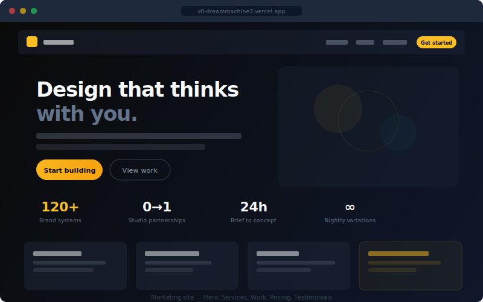
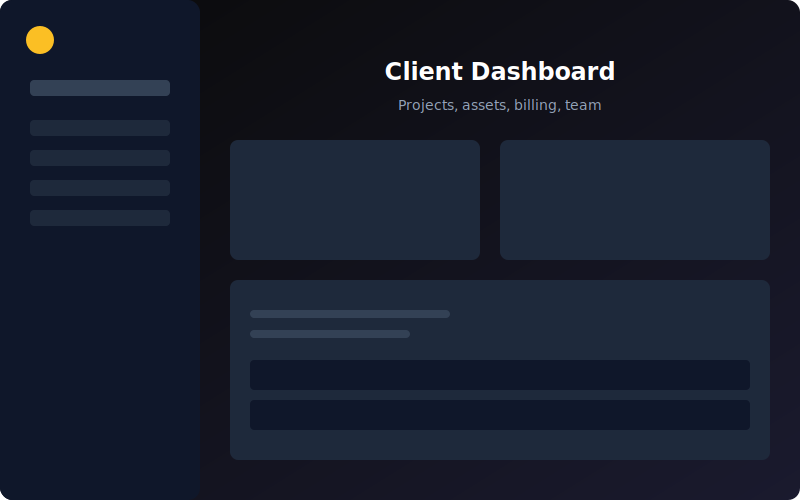
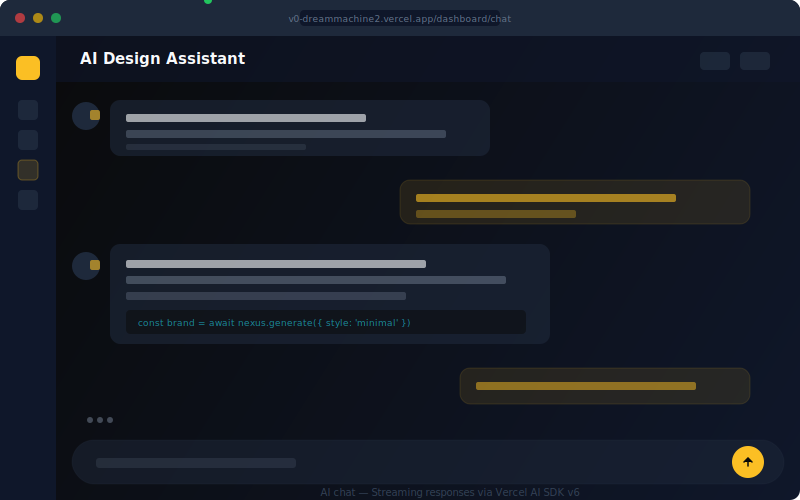
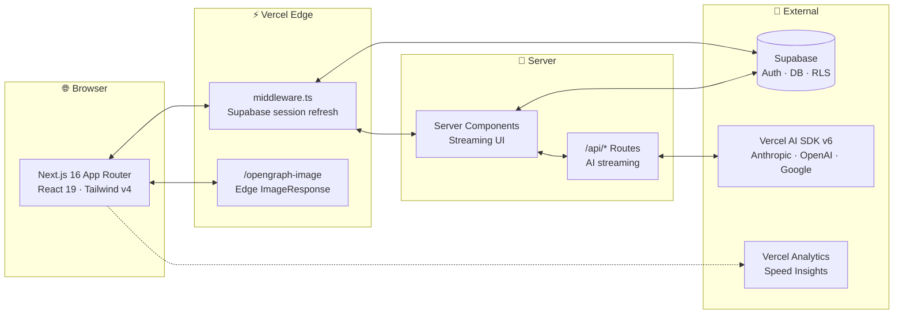

<div align="center">

<a href="https://nexus-ai.techtideai.io">
  <picture>
    <source media="(prefers-color-scheme: dark)" srcset="public/icon.svg">
    
  </picture>
</a>

# Nexus AI

### AI-Native Design Studio

**Brand systems · Generative visuals · Motion · Production-grade web — engineered by AI, finished by humans.**

[](https://github.com/Alexi5000/v0-dreammachine2/actions/workflows/ci.yml)
[](LICENSE)
[](https://nextjs.org)
[](https://react.dev)
[](https://tailwindcss.com)
[](https://sdk.vercel.ai)
[](https://supabase.com)
[](CONTRIBUTING.md)
[](https://codespaces.new/Alexi5000/v0-dreammachine2)

[**Live demo**](https://nexus-ai.techtideai.io) · [**Documentation**](#-getting-started) · [**Roadmap**](#-roadmap) · [**Contributing**](CONTRIBUTING.md) · [**Report a bug**](https://github.com/Alexi5000/v0-dreammachine2/issues/new?template=bug_report.yml)

</div>

---

## ✨ Why Nexus AI

> **The studio is the product.** Nexus AI is the open-source reference implementation of a modern, AI-native creative studio — the kind of marketing site, client portal, and AI workflow you'd want behind your own studio's front door.

It's built so that whether you're a freelancer, agency, or product team, you can fork it, swap the brand, plug in your AI providers, and ship a category-leading site in an afternoon.

| | |
| --- | --- |
| 🧠 **AI-native** | Streaming chat, generative feature pages, real-time content via the Vercel AI SDK v6 — provider-agnostic (Anthropic, OpenAI, Google, or AI Gateway). |
| 🎨 **Apple-tier motion** | Spring curves and easings calibrated from Material 3 / Apple HIG. Every page transition feels intentional. |
| 🔐 **Production auth** | Supabase Auth out of the box — SSR-safe, RLS-friendly, with middleware-level session refresh. |
| 🧱 **Composable** | shadcn/ui + Radix primitives + Tailwind v4 — every component is yours to fork, every token is a CSS variable. |
| ⚡ **Fast by default** | Streaming server components, font preloading, edge OG generation, predictive prefetch. |
| ♿ **Accessible** | Skip-nav, focus-visible rings, semantic landmarks, reduced-motion support, keyboard-first navigation. |
| 📈 **Observable** | Vercel Analytics + Speed Insights wired in. Bring your own PostHog / Plausible. |
| 🧪 **Type-safe** | TypeScript strict, Zod-validated env, React 19 + Next 16. |

---

## 🖼 Preview

> Screenshots are checked into `docs/screenshots/`. Run `pnpm dev` to see the live experience.

| Marketing | Dashboard | AI chat |
| :---: | :---: | :---: |
|  |  |  |

---

## 🧬 Architecture



**Folder map**

```
.
├── app/                  # Next.js App Router
│   ├── (marketing)       # Public landing (hero, services, pricing, work, CTA)
│   ├── auth/             # Supabase login / sign-up / sign-up-success / error
│   ├── dashboard/        # Authenticated client dashboard (admin, analytics, chat, projects)
│   ├── api/              # Edge AI streaming endpoints
│   ├── opengraph-image   # Edge OG generation (1200×630)
│   ├── sitemap.ts        # Dynamic sitemap
│   ├── robots.ts         # Dynamic robots policy
│   └── manifest.ts       # PWA web manifest
├── components/
│   ├── ui/               # shadcn/ui primitives (button, card, input, …)
│   ├── primitives/       # Section-level building blocks
│   ├── dashboard/        # Dashboard shell + nav
│   └── *.tsx             # Marketing sections (hero, services, work, …)
├── lib/
│   ├── site.ts           # Single source of truth for brand strings
│   ├── env.ts            # Zod-validated environment
│   ├── motion.ts         # Spring/easing presets
│   └── supabase/         # Browser + server + middleware clients
├── hooks/                # use-in-view-animation, use-mobile, use-toast
├── scripts/              # SQL migrations for Supabase
└── public/               # Static assets, icons
```

---

## 🚀 Getting started

> **Requirements:** Node.js ≥ 20, pnpm ≥ 9. (npm and bun work too — use what you love.)

```bash
# 1. Clone
git clone https://github.com/Alexi5000/v0-dreammachine2.git nexus-ai
cd nexus-ai

# 2. Install
pnpm install

# 3. Configure environment
cp .env.example .env.local
#   The marketing site renders without any env vars.
#   Add Supabase + AI keys to unlock auth + chat.

# 4. Run the dev server
pnpm dev
```

Open <http://localhost:3000> — you're live.

### One-click deploy

[](https://vercel.com/new/clone?repository-url=https://github.com/Alexi5000/v0-dreammachine2&env=NEXT_PUBLIC_SUPABASE_URL,NEXT_PUBLIC_SUPABASE_ANON_KEY&envDescription=Supabase%20project%20keys%20%E2%80%94%20see%20.env.example&envLink=https://github.com/Alexi5000/v0-dreammachine2/blob/main/.env.example&project-name=nexus-ai&repository-name=nexus-ai)

### Environment variables

All keys are documented in [`.env.example`](.env.example). Summary:

| Key | Required | Notes |
| --- | :---: | --- |
| `NEXT_PUBLIC_SITE_URL` | ✅ | Canonical origin used by OG, sitemap, JSON-LD. |
| `NEXT_PUBLIC_SUPABASE_URL` | for auth | Supabase project URL. |
| `NEXT_PUBLIC_SUPABASE_ANON_KEY` | for auth | Supabase anon key. |
| `SUPABASE_SERVICE_ROLE_KEY` | for admin | Server-only, never expose to the client. |
| `AI_GATEWAY_API_KEY` | for chat | Auto-injected on Vercel. Otherwise add a direct provider key below. |
| `ANTHROPIC_API_KEY` / `OPENAI_API_KEY` / `GOOGLE_GENERATIVE_AI_API_KEY` | optional | Fallback when AI Gateway isn't available. |
| `RESEND_API_KEY`, `CONTACT_TO_EMAIL` | optional | Wire up the contact form. |
| `UPSTASH_REDIS_REST_URL`, `UPSTASH_REDIS_REST_TOKEN` | optional | Rate limiting for AI endpoints. |

Env is validated at startup with Zod ([`lib/env.ts`](lib/env.ts)) and exposes a `features` flag object so feature gating is one import away.

---

## 🛠 Scripts

```bash
pnpm dev          # Start the dev server on http://localhost:3000
pnpm build        # Build production bundle
pnpm start        # Serve the production build
pnpm lint         # ESLint
pnpm typecheck    # TypeScript --noEmit
pnpm format       # Prettier write
pnpm format:check # Prettier check (used by CI)
```

---

## 🧠 Brand & design system

- **Color tokens** live in [`app/globals.css`](app/globals.css) under `:root` and the `@theme inline` block. They map directly onto Tailwind v4 utility classes (`bg-background`, `text-foreground`, etc.).
- **Motion presets** live in [`lib/motion.ts`](lib/motion.ts). Reuse `EASE.emphasized`, `transitions.spring`, and the `fadeInUp` / `headlineWord` variants instead of writing magic numbers.
- **Brand voice + site constants** live in [`lib/site.ts`](lib/site.ts). Updating the studio name, tagline, social links, or canonical URL is a one-file change.

---

## 🗺 Roadmap

- [x] Marketing site (hero, services, process, work, pricing, testimonials, CTA, footer)
- [x] Supabase Auth (email/password + magic link)
- [x] Dashboard shell with sidebar, projects, analytics, settings
- [x] Streaming AI chat (`/dashboard/chat`)
- [x] Edge OpenGraph + Twitter card generation
- [x] PWA manifest, sitemap, robots
- [ ] `/manifesto` page — the studio's point of view
- [ ] Case study templates (`/work/[slug]`)
- [ ] Billing integration (Stripe + Supabase)
- [ ] Realtime collaborative AI canvas
- [ ] Storybook for the primitives library
- [ ] Playwright E2E smoke tests in CI

Have an idea? [Open a feature request](https://github.com/Alexi5000/v0-dreammachine2/issues/new?template=feature_request.yml).

---

## 🧰 Tech stack

| Layer | Choice | Why |
| --- | --- | --- |
| Framework | **Next.js 16** (App Router, Turbopack) | Streaming SSR, edge OG, file-based routing |
| Language | **TypeScript 5.7** | Type safety end-to-end |
| UI | **React 19**, **Tailwind v4**, **shadcn/ui**, **Radix** | Composable, accessible primitives |
| Motion | **motion** (formerly Framer Motion) | Variants, layout animations, spring easings |
| AI | **Vercel AI SDK v6** | Provider-agnostic streaming UI |
| Auth | **Supabase Auth + SSR** | RLS-ready, JWT-based, middleware-driven |
| Forms | **react-hook-form** + **Zod** | Strict client + server validation |
| Analytics | **Vercel Analytics**, **Speed Insights** | Zero-config observability |
| Icons | **lucide-react** + custom marks | Crisp, license-friendly |
| Fonts | **Rubik**, **Space Grotesk**, **JetBrains Mono** (Google Fonts) | Display + body + code, optical-size tuned |

---

## 🤝 Contributing

Pull requests are welcome. Read [CONTRIBUTING.md](CONTRIBUTING.md) for setup, the commit-message convention, and the review process. By participating you agree to abide by the [Code of Conduct](CODE_OF_CONDUCT.md).

For security disclosures, see [SECURITY.md](SECURITY.md).

---

## 📄 License

Released under the [MIT License](LICENSE). © 2026 Alex Cinovoj and Nexus AI contributors.

---

<div align="center">

**Built with ⌥ by [Alex Cinovoj](https://github.com/Alexi5000)** · [Star on GitHub](https://github.com/Alexi5000/v0-dreammachine2) · [Sponsor](https://github.com/sponsors/Alexi5000)

</div>
